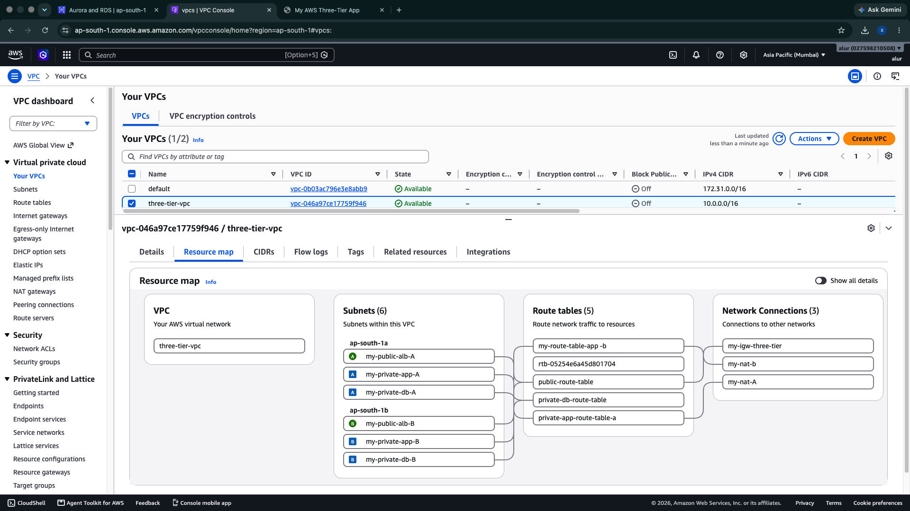
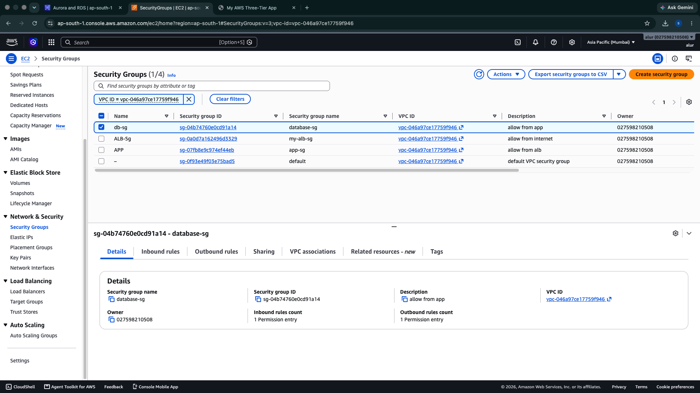
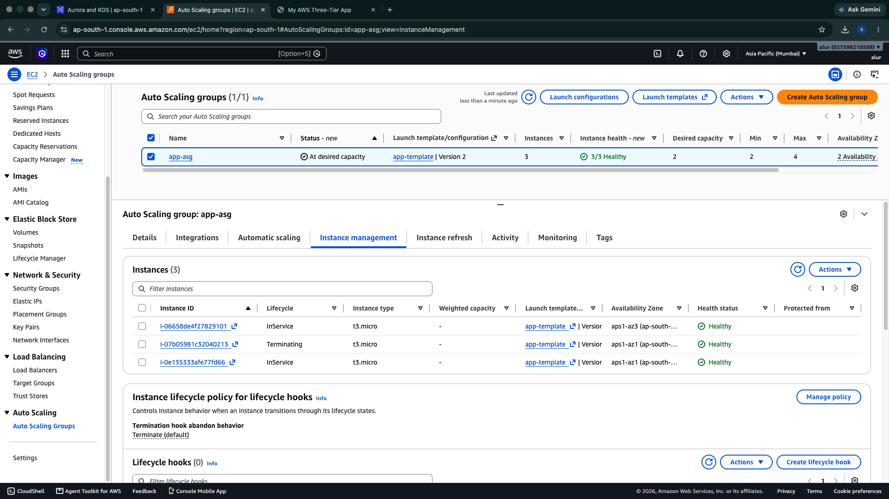

# 🚀 AWS Three-Tier Multi-AZ Architecture

## Overview

This project demonstrates a production-style Three-Tier Architecture deployed on AWS following cloud best practices for High Availability, Scalability, and Security.

The infrastructure spans **2 Availability Zones** and uses an **Application Load Balancer**, **Auto Scaling Group**, **Launch Templates**, and **Amazon RDS**.

---

## Architecture

> Add your architecture diagram here


---

## AWS Services Used

- Amazon VPC
- Public & Private Subnets
- Internet Gateway
- NAT Gateway
- Route Tables
- Security Groups
- EC2
- Launch Templates
- Auto Scaling Group
- Application Load Balancer
- Target Group
- Amazon RDS MySQL

---

## Architecture Flow

```
Internet
      │
      ▼
Application Load Balancer
      │
      ▼
Target Group
      │
      ▼
Auto Scaling Group
      │
 ┌───────────────┐
 │               │
EC2 Instance   EC2 Instance
      │
      ▼
Amazon RDS MySQL
```

---

## Features

- High Availability across 2 Availability Zones
- Auto Scaling
- Application Load Balancer
- Private Database
- Secure Security Groups
- Launch Templates
- Instance Refresh
- Health Checks
- Target Group Routing

---

## Project Workflow

1. Create VPC
2. Create Public and Private Subnets
3. Attach Internet Gateway
4. Configure Route Tables
5. Configure NAT Gateway
6. Launch Web Server EC2
7. Install Apache using User Data
8. Create Launch Template
9. Create Target Group
10. Create Application Load Balancer
11. Create Auto Scaling Group
12. Configure Health Checks
13. Test Load Balancer DNS

---

## Project Screenshots

### VPC



### Subnets


### Route Tables


### Security Groups



### Launch Template


### Target Group


### Application Load Balancer



### Auto Scaling Group


### EC2 Instances


### Amazon RDS


### Final Website


---

## Skills Demonstrated

- AWS Networking
- High Availability
- Auto Scaling
- Load Balancing
- Amazon RDS
- Security Groups
- Launch Templates
- Infrastructure Design
- Cloud Architecture

---

## Author

**Srinil Reddy**

LinkedIn:
https://linkedin.com/in/srinil-reddy

GitHub:
https://github.com/SRINILREDDY