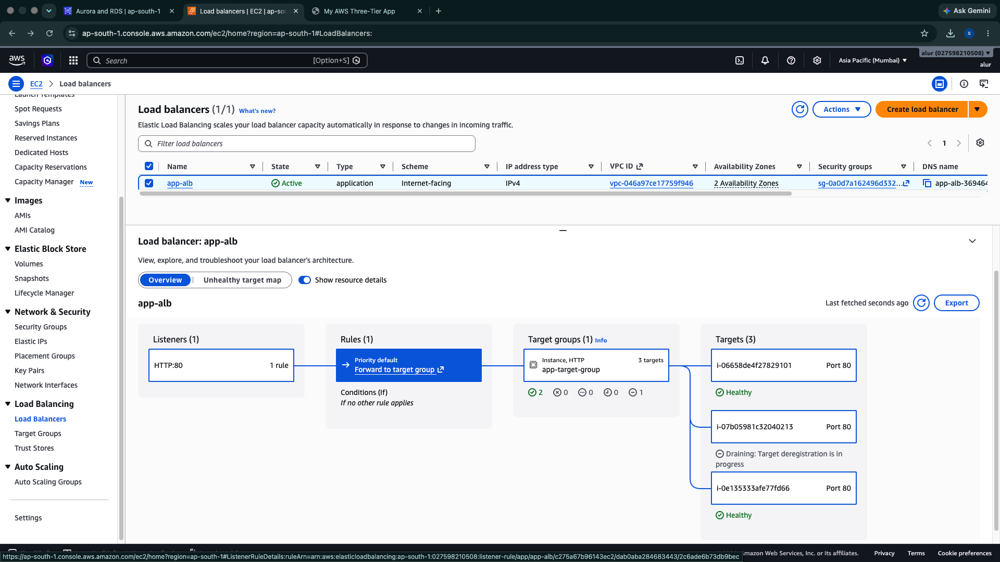
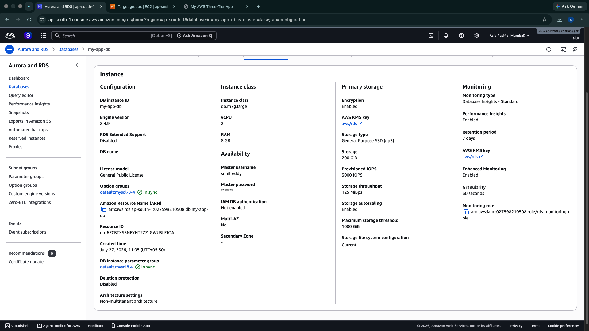
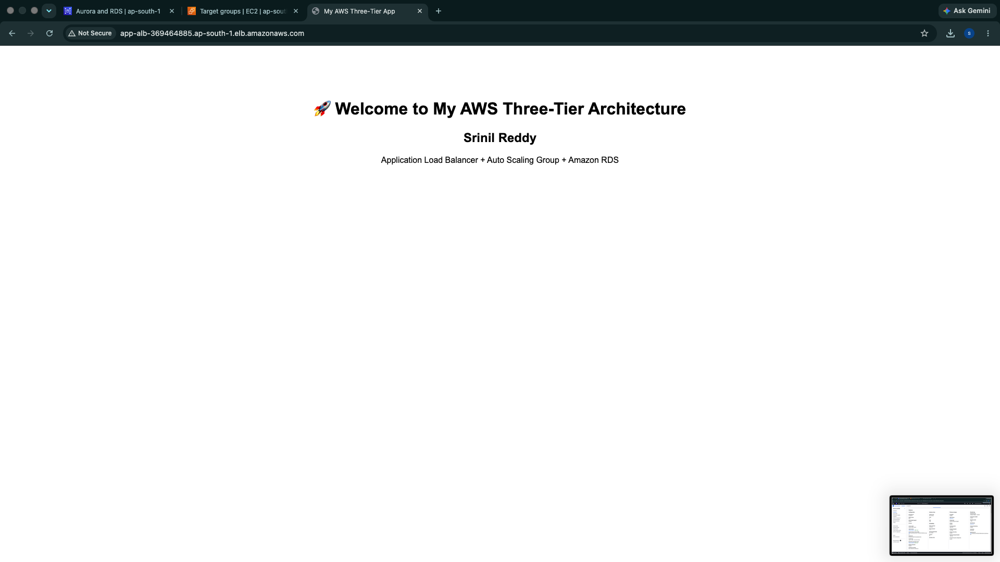

# 🚀 AWS Three-Tier Multi-AZ Architecture

## 📌 Overview

This project demonstrates a production-style **AWS Three-Tier Architecture** designed for **high availability, scalability, and security**. The infrastructure spans **two Availability Zones** and uses an **Application Load Balancer**, **Auto Scaling Group**, and **Amazon RDS** to simulate a real-world enterprise deployment.

The demonstration web page runs on EC2 instances in private subnets behind an ALB and Auto Scaling Group. Amazon RDS is a separate private database tier.

**Scope:** `userdata.sh` installs Apache and serves static HTML. The current demo does not connect to MySQL. Database-backed application integration and demand-based scaling policies are future extensions.

---

## 🔄 Architecture Flow

```text
Users
   │
   ▼
Application Load Balancer
   │
   ▼
Target Group
   │
   ▼
Auto Scaling Group
   │
   ▼
EC2 Web Servers (Private Subnets)

Separate database infrastructure:
Amazon RDS MySQL (Private Subnets)
(Application-to-database integration is not implemented)
```

---

## Deployment Evidence






The architecture image describes the infrastructure tiers. The static demo does not exercise an application-to-database connection.

## ☁️ AWS Services Used

- Amazon VPC
- Public Subnets
- Private Application Subnets
- Private Database Subnets
- Internet Gateway
- NAT Gateway
- Route Tables
- Security Groups
- Network ACLs
- Amazon EC2
- Launch Templates
- Auto Scaling Group
- Application Load Balancer (ALB)
- Target Group
- Amazon RDS MySQL

---

## ✨ Project Highlights

- Designed and deployed a production-style AWS Three-Tier Architecture across two Availability Zones.
- Built a custom Amazon VPC with public and private subnets.
- Configured an Application Load Balancer to distribute incoming traffic.
- Deployed EC2 instances using Launch Templates.
- Configured an Auto Scaling Group for capacity management and instance replacement.
- Configured Amazon RDS MySQL in private database subnets.
- Secured the infrastructure using Security Groups and Network ACLs.
- Updated EC2 instances using Launch Template Versioning and Instance Refresh.

---

## 🏛️ Infrastructure Components

### Networking

- Amazon VPC
- Internet Gateway
- NAT Gateway
- Public Subnets
- Private Application Subnets
- Private Database Subnets
- Route Tables

### Compute

- Amazon EC2
- Launch Template
- Auto Scaling Group

### Load Balancing

- Application Load Balancer
- Target Group
- Health Checks

### Database

- Amazon RDS MySQL

---

## 🔒 Security

- Security Groups configured as instance-level firewalls.
- Network ACLs configured as subnet-level firewalls.
- EC2 instances deployed in private subnets without public IP addresses.
- Amazon RDS deployed in private database subnets.
- Internet access for private instances provided through a NAT Gateway.

---

## 🛠️ Skills Demonstrated

- AWS Cloud Architecture
- Amazon VPC
- Amazon EC2
- Auto Scaling
- Application Load Balancing
- Amazon RDS
- AWS Networking
- High Availability
- Infrastructure Design
- Linux Administration

---

## 📂 Repository Structure

```text
aws-three-tier-multi-az-architecture
│
├── README.md
├── userdata.sh
└── images/
```

---

## 🎯 Outcome

The documented infrastructure deployment demonstrates the following:

- Users access the application through an Application Load Balancer.
- The Target Group routes traffic to healthy EC2 instances.
- The Auto Scaling Group manages EC2 capacity and replaces instances.
- Amazon RDS MySQL is deployed in private subnets for secure database access.
- The infrastructure separates public entry points, private web instances, and private database subnets.
- End-to-end database-backed application behavior remains to be implemented and tested.

---

## Author

**Srinil Reddy**

Cloud Engineer | AWS | Linux | Networking

[GitHub](https://github.com/SRINILREDDY) · [LinkedIn](https://www.linkedin.com/in/srinilreddy)
